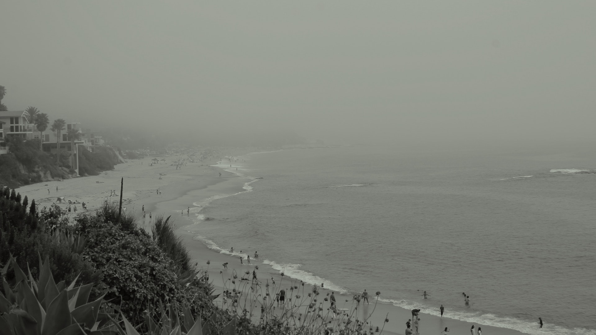
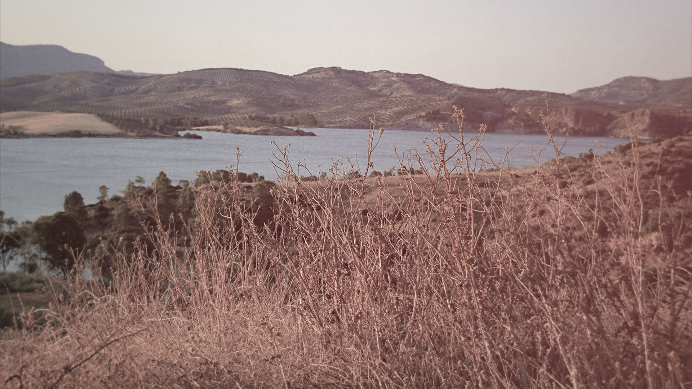
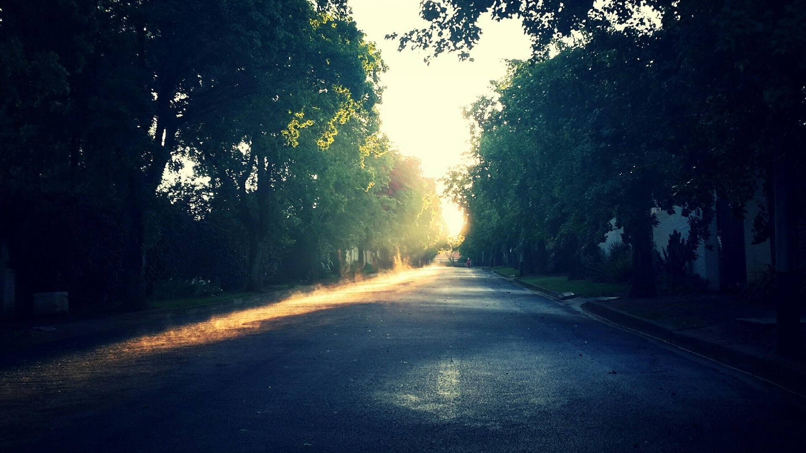
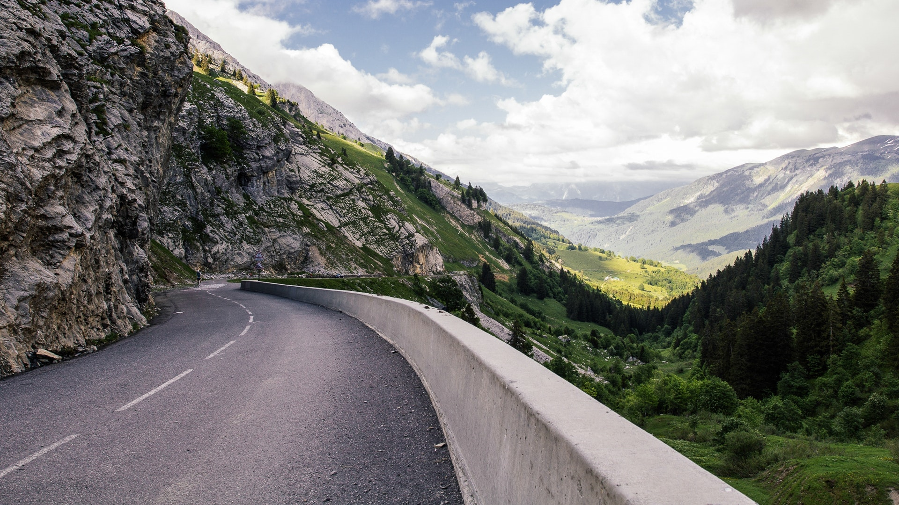
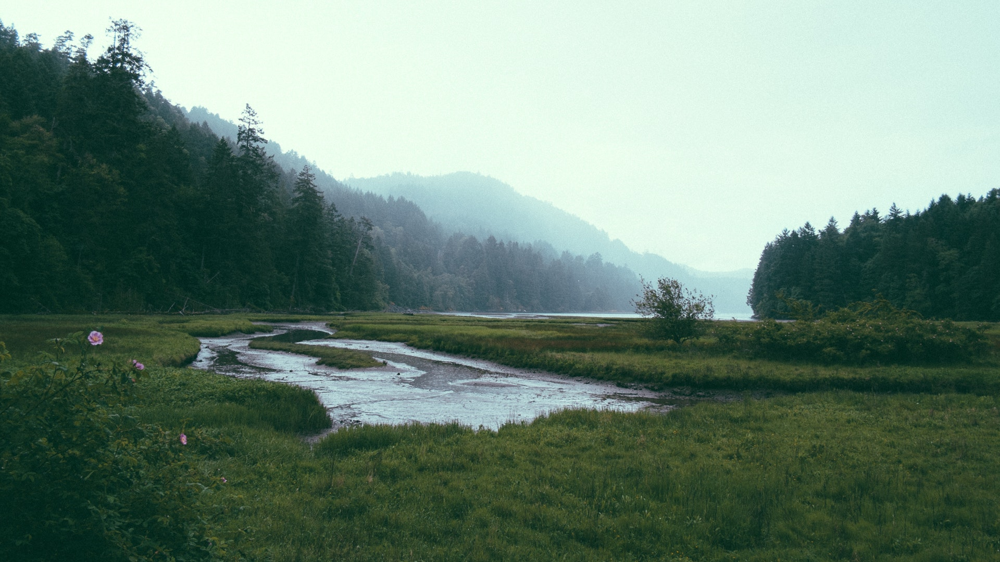
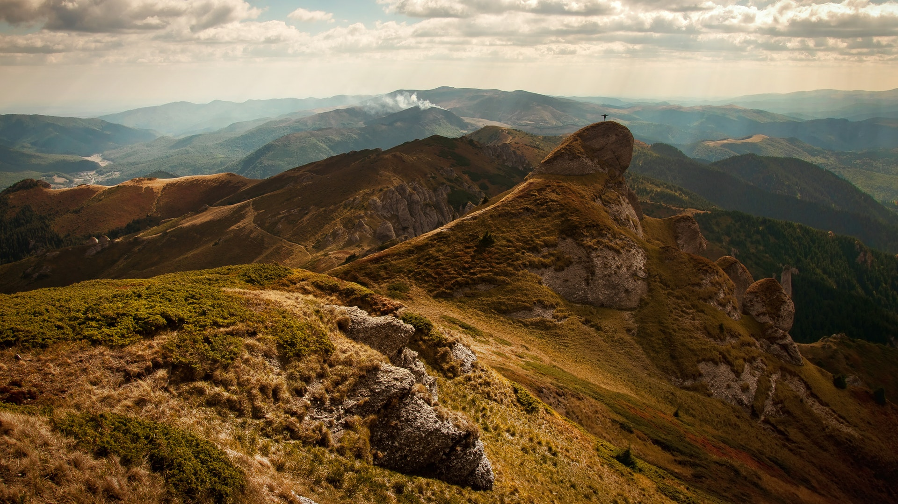

# unsplasher

This little script uses [Unsplash's](https://unsplash.com) api to bulk download beautiful photos from their featured collection. For use in desktop backgrounds
and such. The default resolution is 1920x1080 and it can be changed by editing the resolution variable in the file. Takes one command line argument which is the number of images you want. Requires Python 3.

Usage

```
python unsplasher.py 50
```

Where 50 is the number of images you want.


<p float="left">
  
   
  
  
   
  
  
</p>
